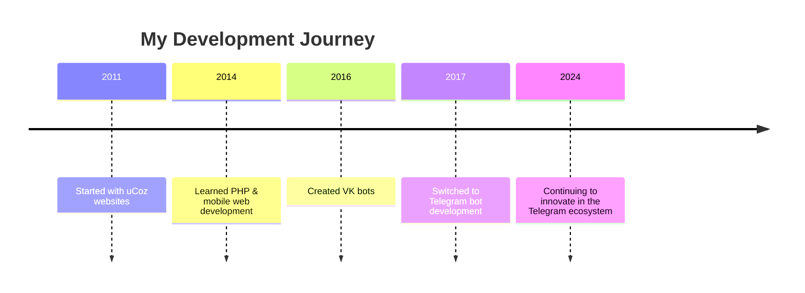

# Hey there, I'm Yuri 👋

  
  
  
  
  
  
  

## 💜 About Me

I'm a passionate **Web Developer** from Ukraine 🇺🇦 specializing in creating powerful and user-friendly Telegram bots. At 24, I've been crafting digital experiences for over a decade, with a particular focus on building tools that make people's lives easier.

- 🤖 **Telegram Bot Expert** - Creating innovative bots since 2017
- 🎮 **Gaming Enthusiast** - I see games as art and love observing the industry
- 🍜 **Culture Explorer** - Passionate about Asian cuisine and culture
- 💜 **Purple Lover** - It's not just a color, it's a lifestyle

## 🛠️ Tech Stack

## 🚀 Featured Projects

### 📸 [Quote Bot](https://github.com/LyoSU/quote-bot)
A powerful Telegram bot for creating beautiful quote images from messages. Turn any conversation into shareable, aesthetic quotes with customizable styles and formats.

### 🔧 [Quote API](https://github.com/LyoSU/quote-api)
The backend API powering the Quote Bot ecosystem. Features include:
- Generate quote images with custom styling
- Support for multiple message formats
- Gradient backgrounds and emoji brands
- RESTful API for easy integration

## 🏆 Achievements & Highlights

  
  🚀 **10+ Years** in Web Development | 🤖 **7+ Years** Building Telegram Bots  
  💡 **Open Source** Contributor | 🌍 **Global** User Base  
  

## 📈 My Journey

## 📊 GitHub Stats

  
  
  
  
  
  
  

## 🎮 Gaming Corner

- 🎮 **Platforms**: Nintendo Switch, Xbox, PS4
- 🎯 **Philosophy**: Games are art - I observe more than I play
- 🎲 **Nintendo Friend Code**: SW-2573-5817-3401

## 📫 Connect With Me

  
  **💬 Telegram Channel**: [LyDev](https://LyDev.t.me)  
  **🌐 Website**: [yuri.ly](https://yuri.ly)  
  **📝 Blog**: [telegra.ph/ly-02-27](https://telegra.ph/ly-02-27)
  

## 💖 Support My Work

If you find my projects helpful, consider supporting my work:

**BTC**: `17QaN4wPZFaH4qtsgDdTaYwiW9s9PUcHj7`  
**ETH/BUSD**: `0x34007b75775F8DAe005A407141617aA2fBa2740c`  
**TON**: `EQAwN6PpFOo1LFVIh5hkVjearXvrqOvPD-nyqLjVz-fPbn_s`

---

  
  *"Creating engaging user experiences by leveraging the latest technologies"* 💜
  
  
  
  
  

